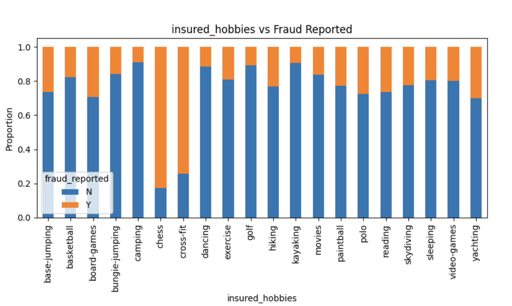
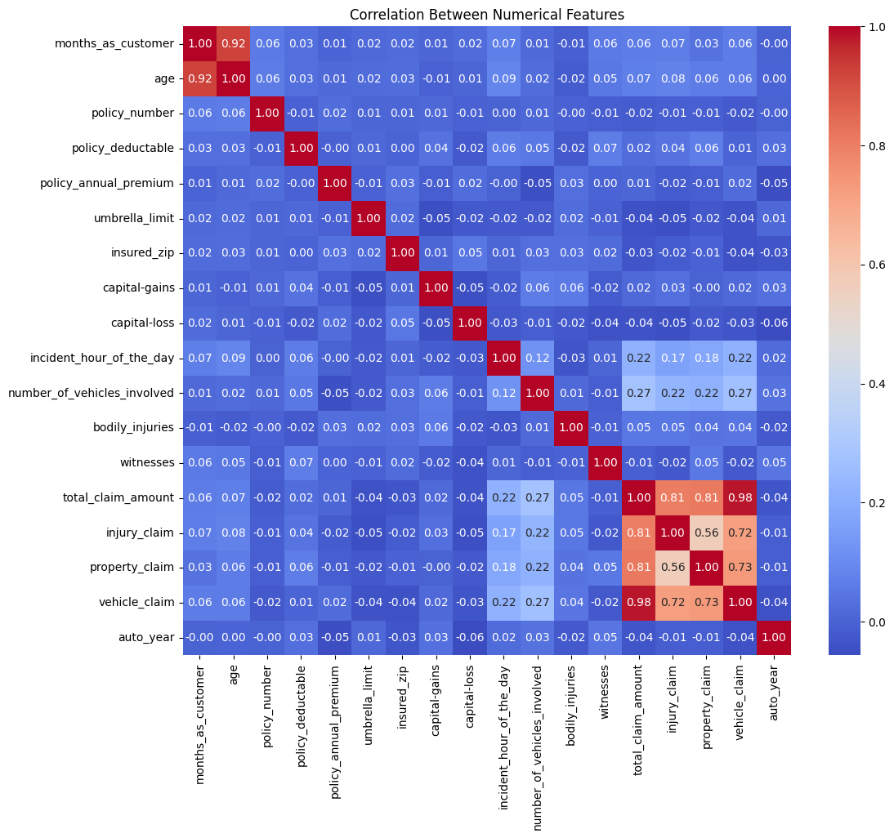

# Insurance Fraud Detection using Ensemble Machine learning

  
  
  
  

This project delivers an end-to-end machine learning solution designed to detect fraudulent insurance claims, a critical task for mitigating financial losses in the insurance industry. [cite_start]The system analyzes a complex dataset of 39 features to accurately classify claims as fraudulent or legitimate[cite: 3].

The project addresses the key challenge of class imbalance by systematically training and evaluating a wide range of models. It culminates in the development of a sophisticated **soft-voting ensemble classifier**, which combines the strengths of the top-performing models to achieve superior predictive accuracy and high recall for fraudulent cases.

### Core Features:
* [cite_start]**In-Depth EDA:** Uncovered non-obvious patterns, including a high correlation between certain customer hobbies (e.g., chess, cross-fit) and fraudulent claims[cite: 9].
* [cite_start]**Advanced Feature Engineering:** Developed novel, insightful features such as `claim_severity_ratio` and `from_bind_to_incident_months` to enhance model performance[cite: 5, 68].
* [cite_start]**Rigorous Model Benchmarking:** Systematically trained, tuned (`GridSearchCV`), and evaluated a wide array of models, from Logistic Regression to powerful ensembles like Random Forest, Gradient Boosting, and XGBoost[cite: 15, 20, 32, 44].
* [cite_start]**Sophisticated Ensembling:** Constructed a final **Voting Classifier** that leverages the probabilistic predictions of the top three models (Decision Tree, Random Forest, XGBoost) to maximize recall and ROC-AUC score[cite: 55].

---

## Table of Contents
- [Tech Stack](#tech-stack)
- [Machine Learning Workflow](#machine-learning-workflow)
  - [1. Exploratory Data Analysis (EDA)](#1-exploratory-data-analysis-eda)
  - [2. Feature Engineering & Preprocessing](#2-feature-engineering--preprocessing)
  - [3. Model Benchmarking & Hyperparameter Tuning](#3-model-benchmarking--hyperparameter-tuning)
  - [4. Final Ensemble Model: The Voting Classifier](#4-final-ensemble-model-the-voting-classifier)
- [Project Structure](#project-structure)
- [How to Run This Project](#how-to-run-this-project)

---

## Tech Stack

| Component             | Technology / Library                                       |
| --------------------- | ---------------------------------------------------------- |
| **Language** | Python 3                                                   |
| **Data Manipulation** | Pandas, NumPy                                              |
| **Data Visualization**| Matplotlib, Seaborn                                        |
| **Machine Learning** | Scikit-learn                                               |
| **Ensemble Models** | XGBoost, LightGBM                                          |
| **Development** | Jupyter Notebook, VS Code                                  |

---

## Machine Learning Workflow

The project was executed through a structured pipeline to ensure a robust and reproducible outcome.

### 1. Exploratory Data Analysis (EDA)
* **Source Notebook:** `notebooks/eda.ipynb`
* [cite_start]An extensive EDA was performed on the dataset of 1000 insurance claims to identify underlying patterns and data quality issues[cite: 6].
* **Key Findings:**
    * [cite_start]The target variable `fraud_reported` was imbalanced, with only 24.7% of claims being fraudulent, requiring special handling during modeling[cite: 7].
    * [cite_start]A surprising discovery was the high fraud rates associated with hobbies like "chess" (82.6%) and "cross-fit" (74.3%), which were later used for feature engineering[cite: 9].
    * [cite_start]High collinearity was found among claim amount features (`total_claim_amount`, `injury_claim`, etc.), leading to the decision to drop redundant columns and retain only the total amount[cite: 20, 21].
    * [cite_start]The `authorities_contacted` column was the only one with a significant number of missing values (91)[cite: 5].

### 2. Feature Engineering & Preprocessing
* **Source Notebook:** `notebooks/preprocessing.ipynb`
* The raw data was transformed into a clean, model-ready format through targeted feature engineering and preprocessing.
* **Key Steps:**
    * **Feature Creation:** Engineered several new features to add predictive power, including:
        * [cite_start]`claim_severity_ratio`: The ratio of total claim amount to the policy's annual premium[cite: 5].
        * [cite_start]`is_high_risk_hobby`: A binary flag for customers with hobbies found to have an extremely high correlation with fraud[cite: 23].
        * [cite_start]`from_bind_to_incident_months`: The customer's tenure in months at the time of the incident[cite: 9].
    * [cite_start]**Data Cleaning:** Corrected data entry errors (e.g., a negative `umbrella_limit` value [cite: 16][cite_start]) and replaced placeholder '?' values with a meaningful 'Unknown' category[cite: 20].
    * [cite_start]**Encoding:** Applied a mix of encoding strategies, including one-hot encoding for nominal categories, label encoding for tree-based models, and manual ordinal mapping for features like `incident_severity`[cite: 28, 10].
    * [cite_start]**Feature Dropping:** Removed columns with high cardinality and low signal (e.g., `policy_number`, `incident_city`) to reduce noise[cite: 12, 13].

### 3. Model Benchmarking & Hyperparameter Tuning
* **Source Notebooks:** `notebooks/model-training.ipynb`, `notebooks/tree-models.ipynb`
* A wide range of classification models were trained and systematically evaluated. [cite_start]For tree-based models, `GridSearchCV` was employed to find the optimal hyperparameters by optimizing for the F1-score[cite: 15, 20, 32, 44].

#### Performance Comparison of Tuned Models:

| Model                 | Fraud Precision | Fraud Recall | Fraud F1-Score | ROC-AUC |
| :-------------------- | :-------------: | :----------: | :------------: | :-----: |
| Logistic Regression   |      0.36       |     0.43     |      0.39      |  0.623  |
| Decision Tree         |      0.64       |     0.86     |      0.73      |  0.841  |
| Random Forest         |      0.64       |     0.86     |      0.73      |  0.836  |
| Gradient Boosting     |      0.61       |     0.47     |      0.53      |  0.832  |
| XGBoost               |      0.63       |     0.84     |      0.72      |  0.830  |
| LightGBM              |      0.62       |     0.73     |      0.67      |  0.831  |

### 4. Final Ensemble Model: The Voting Classifier
* **Source Notebook:** `notebooks/tree-models.ipynb`
* To create a more robust and powerful final model, a **soft-voting ensemble** was constructed. [cite_start]This classifier combines the prediction probabilities of the top three best-performing individual models: the tuned **Decision Tree, Random Forest, and XGBoost classifiers**[cite: 55].
* By averaging their probabilistic outputs, the voting classifier smooths out individual model biases and leverages their collective strengths.

#### Final Model Performance:

| Voting Classifier | Fraud Precision | Fraud Recall | Fraud F1-Score | ROC-AUC |
| :--- | :---: | :---: | :---: | :---: |
| **Final Model** | **0.64** | **0.86** | **0.73** | **0.842** |

The final ensemble model achieved the highest ROC-AUC score while maintaining an excellent **recall of 86%** for fraudulent claims. This high recall is critical for a fraud detection system, as it ensures that the vast majority of suspicious claims are successfully flagged for review.

---

## Project Structure

"""
/
├── assets/
│   ├── hobby_fraud_rate.png
│   └── correlation_heatmap.png
├── data/
│   ├── cleaned_3_insurance.csv
│   └── Worksheet in Case Study question 2.xlsx
├── notebooks/
│   ├── EDA.ipynb
│   ├── preprocessing.ipynb
│   ├── model_training.ipynb
│   └── tree_models.ipynb
├── README.md
└── requirements.txt
"""